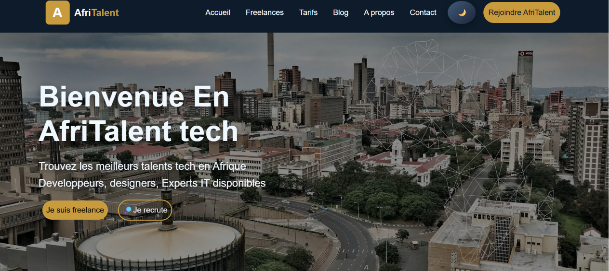
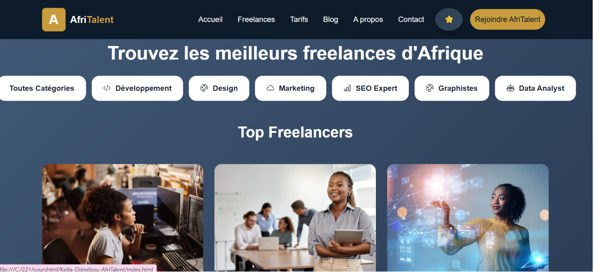
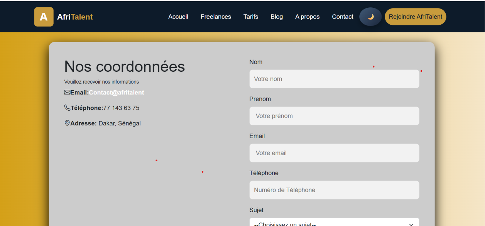
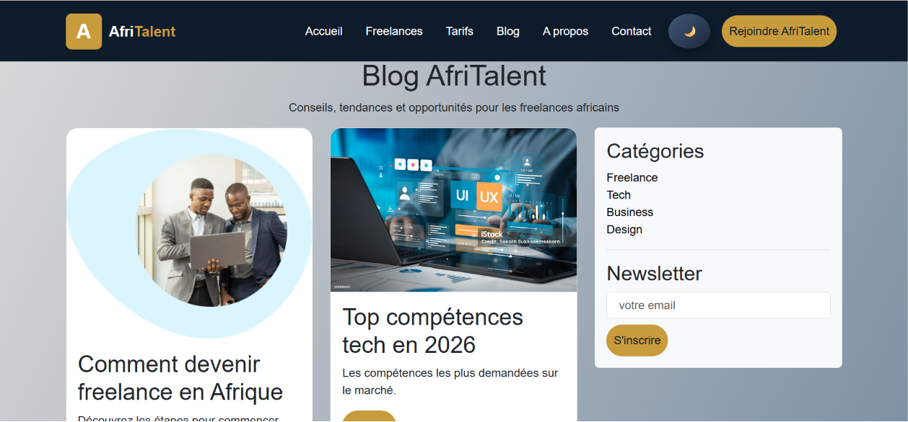
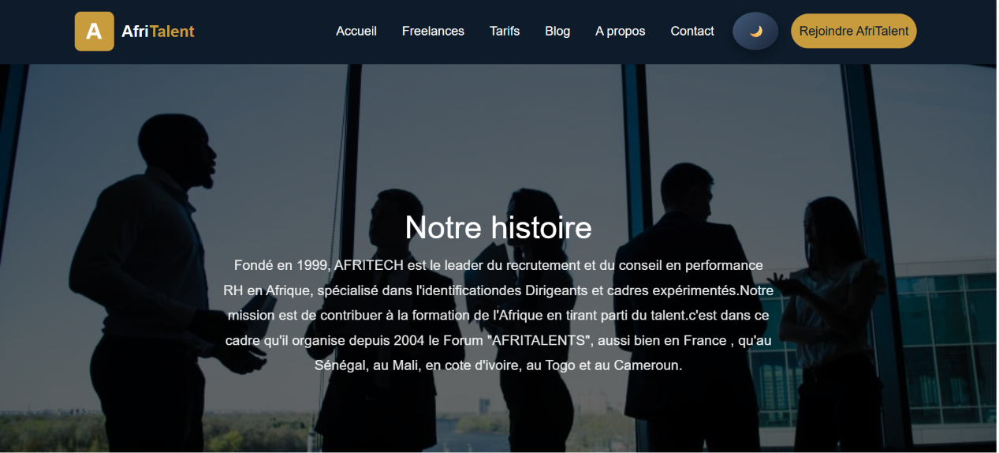
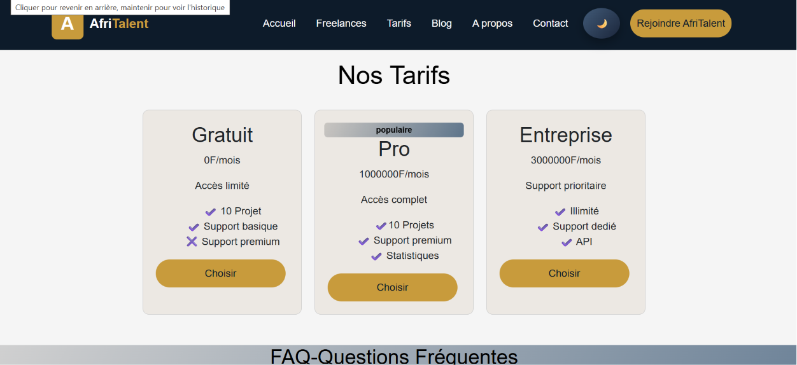

# AfriTalent
Projet fil rouge — Plateforme de mise en relation entre freelances africains et
clients.
Auteur : Djenebou keita
Promotion : L1 Web — ISI

# AfriTalent Tech 🌍💻

# 📖 Présentation
**AfriTalent Tech** est une plateforme web développée pour faciliter le recrutement de talents numériques en Afrique. Elle permet aux entreprises de trouver rapidement des freelances qualifiés et offre aux professionnels africains un espace pour valoriser leurs compétences et développer leur carrière.
Le projet a été conçu comme une application front-end moderne mettant en pratique les concepts essentiels du développement web : responsive design, composants Bootstrap, interactions JavaScript et expérience utilisateur.

## ✨ Fonctionnalités principales

### 🏠 Page d'accueil

* Présentation de la plateforme ;
* Statistiques et témoignages ;
* Catégories de services ;
* Mode sombre ;
* Bouton retour en haut.

### 👨🏾‍💻 Gestion des freelances

* Catalogue des profils ;
* Filtrage par catégories ;
* Fiches détaillées des freelances.

### 📞 Communication

* Formulaire de contact ;
* Coordonnées de l'entreprise ;
* Carte Google Maps.

### 📰 Contenu et informations

* Blog avec conseils pratiques ;
* Newsletter ;
* Page « À propos » présentant l'équipe et les valeurs.

### 💰 Tarifs et assistance

* Différentes offres d'abonnement ;
* FAQ interactive.

---

## 🛠️ Technologies utilisées

* HTML5
* CSS3
* JavaScript
* Bootstrap 5
* Bootstrap Icons
* Google Fonts (Poppins)

---

## 📁 Structure du projet

```
Keita-Djénébou -AfriTaLent/					
│  .gitignore
│   about.html
│   blog.html
│   contact.html
│   freelances.html
│   index.html
│   README.md
│   tarifs.html
├───css							 
│    style.css  
|    index.css 
|    freelances.css
|    contact.css  
|    blog.css  
|    about.css  
|    tarifs.css  
|    style.css
├───docs						
│       Keita_Djénébou.pptx       						
├───images
│       
└───js
        main.js

```
## Les captures d'ecran des pages
 # 📸 Aperçu du projet

## 🏠 Page d'accueil

---
## 👨🏾‍💻 Catalogue des freelances

---
## 📞 Page Contact

---
## 📰 Blog

---
## 🏢 À propos


---
## 💰 Tarifs et FAQ


## 📱 Responsive Design
L'interface est optimisée pour :
* 💻 Ordinateurs;
* 📱 Smartphones;
* 📟 Tablettes;

Bootstrap garantit une expérience utilisateur fluide sur tous les écrans.
---
## lien visionnaire
https://zeinabkeita2025-ship-it.github.io/Keita-Djenebou-AfriTalent
## Le lien github
https://github.com/zeinabkeita2025-ship-it/Keita-Djenebou-AfriTalent

## 🔮 Évolutions futures

Les fonctionnalités suivantes pourraient être ajoutées :

* Authentification (connexion / inscription) ;
* Gestion des rôles ;
* Tableau de bord recruteurs ;
* Tableau de bord freelances ;
* Publication dynamique des projets ;
* Base de données ;
* API backend ;
* Messagerie interne ;
* Paiement sécurisé ;
* Recherche avancée ;
* Administration du blog ;
* Notifications en temps réel.

---

###  Vision du projet

**AfriTalent Tech** ambitionne de devenir un pont entre les entreprises africaines et les talents du numérique afin de contribuer au développement de l'écosystème technologique du continent.
